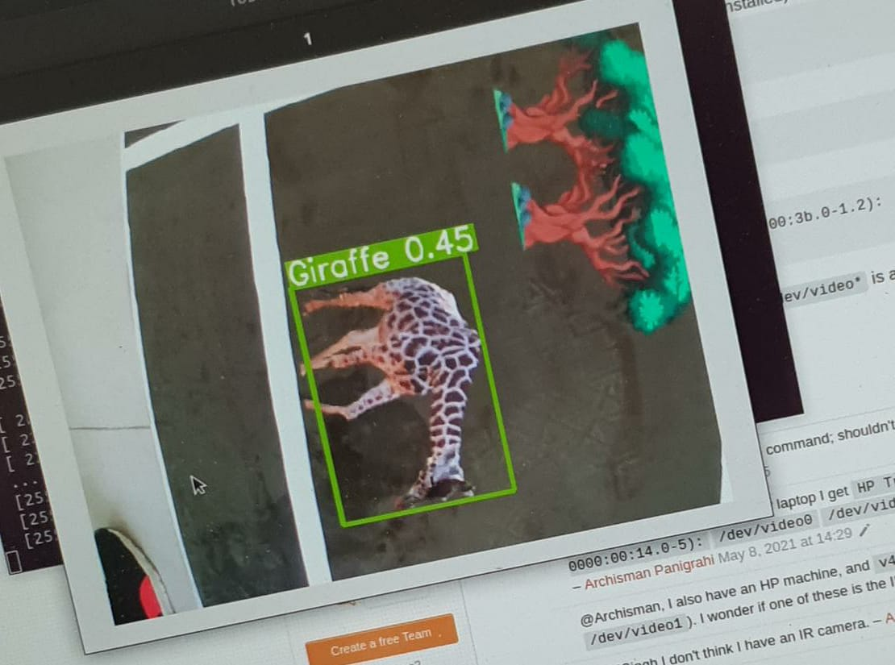
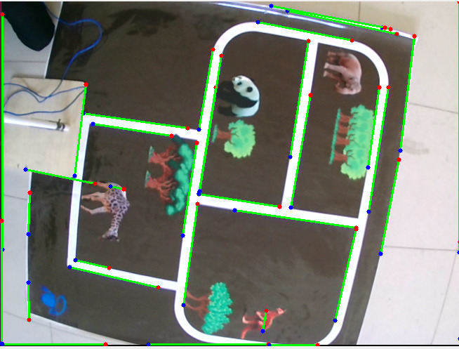
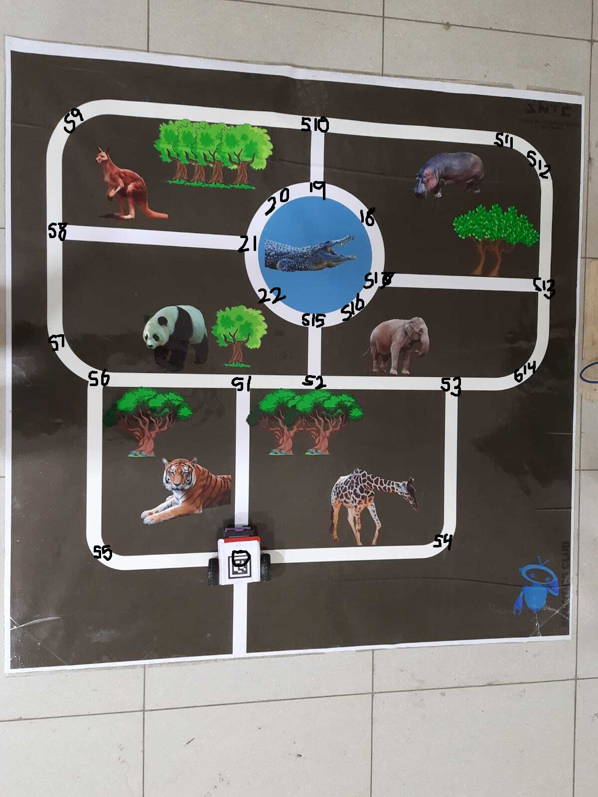

# Hardwired-22

## Project Overview

**Hardwired-22** is an innovative project that harnesses object detection techniques, advanced algorithms, and real-time robotics to achieve efficient animal detection and path planning. By employing cutting-edge technologies and methodologies, the project seamlessly integrates object detection and pathfinding, paving the way for effective and automated animal tracking and interaction.

## Image Detection Results

The project's image detection capabilities are exemplified in the following image:

## Path Planning and Map

In the pursuit of efficient animal tracking, the project's path planning and map come into play:

## Project Description

The central focus of **Hardwired-22** is the identification of animals using object detection techniques, particularly YOLOv5. Once the animals are detected, along with their respective coordinates, the project employs the Djikstra algorithm for determining the shortest paths to reach them. 

The integration of ROS (Robot Operating System) plays a pivotal role in orchestrating the movement of the robotic platform. This allows for seamless coordination between the detection, planning, and execution phases of the project.

## Highlights

- **Object Detection:** The project utilizes YOLOv5 for accurate and real-time animal detection.

- **Path Planning:** Djikstra's algorithm is employed to calculate the shortest paths to reach detected animals.

- **ROS Integration:** The Robot Operating System (ROS) facilitates the movement and control of the robot, enabling precise and coordinated navigation.

## How It Works

1. Object detection techniques, specifically YOLOv5, are employed to identify animals within the environment.

2. The detected animals' coordinates are obtained, serving as endpoints for the pathfinding process.

3. The Djikstra algorithm is used to calculate optimal paths to reach each detected animal.

4. ROS is leveraged to execute the calculated paths, orchestrating the robot's movements.

## Achievements

**Hardwired-22** represents a successful fusion of state-of-the-art computer vision, path planning, and robotic control. The project showcases the potential of technology to enable efficient animal tracking and interaction. The integration of various components creates a holistic solution that can be expanded for broader applications.

## Future Prospects

As technology continues to evolve, the project opens doors to future enhancements. Potential developments include multi-robot coordination, dynamic obstacle avoidance, and real-time interaction with the environment. By embracing emerging technologies, **Hardwired-22** has the potential to shape the future of automated animal tracking and interaction.

